# 🚀 Multi-Tier AWS Cloud Infrastructure Automation using Terraform

## 📌 Project Overview

Designed and deployed a production-grade multi-tier AWS infrastructure using Terraform with Infrastructure as Code (IaC) principles.

The architecture includes:

* VPC
* Public & Private Subnets
* Internet Gateway
* NAT Gateway
* Route Tables
* Security Groups
* EC2 Instances
* Application Load Balancer (ALB)
* Auto Scaling Group (ASG)
* Launch Template
* RDS MySQL Database
* Terraform Outputs & Variables

---

# 🏗️ Architecture Diagram


---

# ☁️ AWS Services Used

| Service            | Purpose                              |
| ------------------ | ------------------------------------ |
| VPC                | Network isolation                    |
| Public Subnets     | Internet-facing resources            |
| Private Subnets    | Secure internal resources            |
| Internet Gateway   | Public internet access               |
| NAT Gateway        | Outbound internet for private subnet |
| Security Groups    | Firewall rules                       |
| EC2                | Web server hosting                   |
| ALB                | Traffic distribution                 |
| Auto Scaling Group | Automatic scaling                    |
| Launch Template    | EC2 configuration template           |
| RDS MySQL          | Managed relational database          |
| Terraform          | Infrastructure as Code               |

---

# 📁 Terraform Files

| File         | Description                 |
| ------------ | --------------------------- |
| provider.tf  | AWS provider configuration  |
| vpc.tf       | VPC, IGW, Route Tables, NAT |
| subnets.tf   | Public & Private subnets    |
| security.tf  | Security Groups             |
| ec2.tf       | EC2 instance configuration  |
| alb.tf       | ALB, Listener, Target Group |
| asg.tf       | Launch Template & ASG       |
| rds.tf       | RDS database setup          |
| outputs.tf   | Terraform outputs           |
| variables.tf | Variables configuration     |

---

# ⚙️ Terraform Commands

## Initialize Terraform

```bash
terraform init
```

## Validate Terraform Code

```bash
terraform validate
```

## Preview Infrastructure

```bash
terraform plan
```

## Deploy Infrastructure

```bash
terraform apply -auto-approve
```

## Destroy Infrastructure

```bash
terraform destroy -auto-approve
```

---

# 📸 Project Screenshots

## Terraform State List

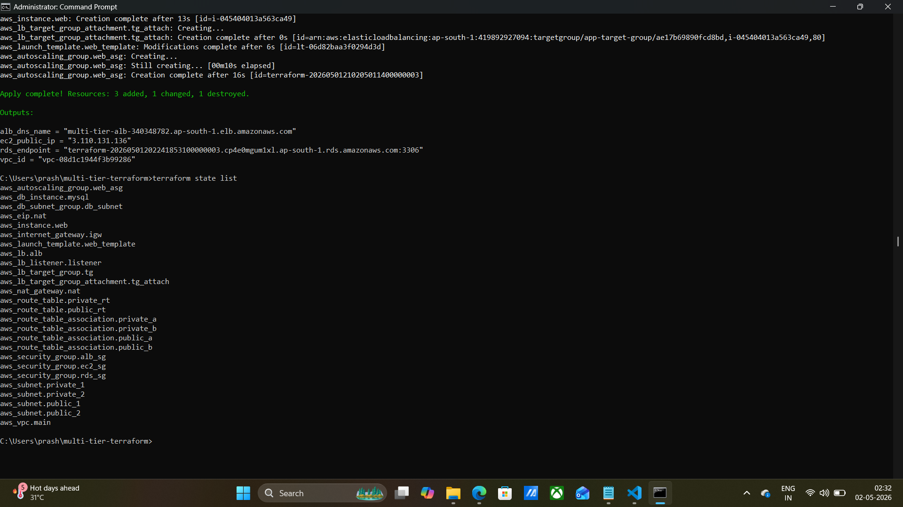

---

## Terraform Output

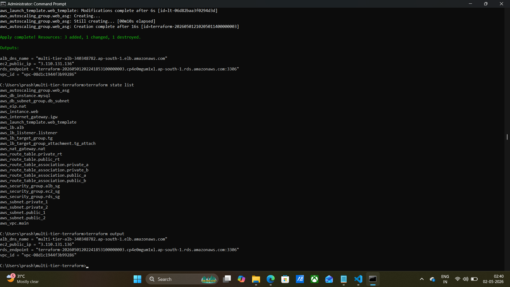

---

## VPC

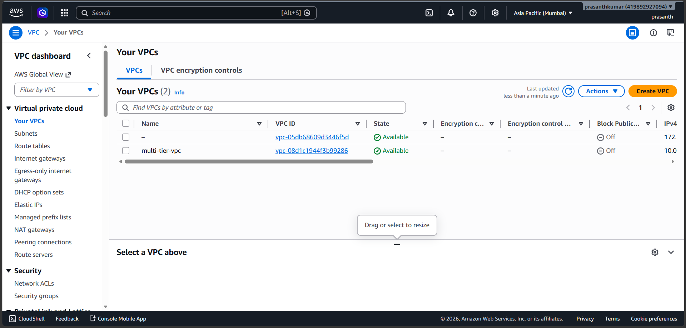

---

## Subnets

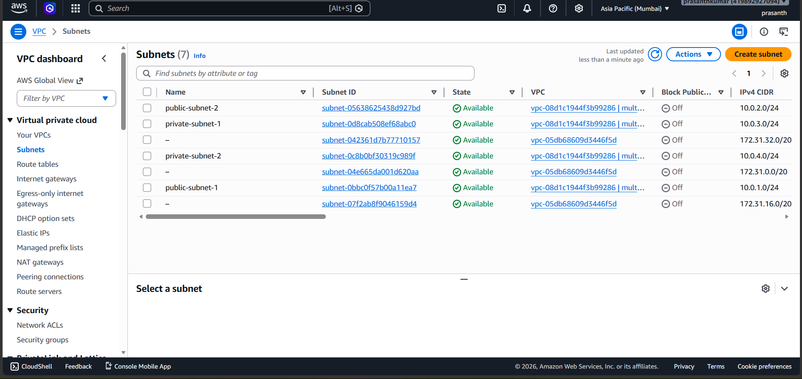

---

## EC2 Instances

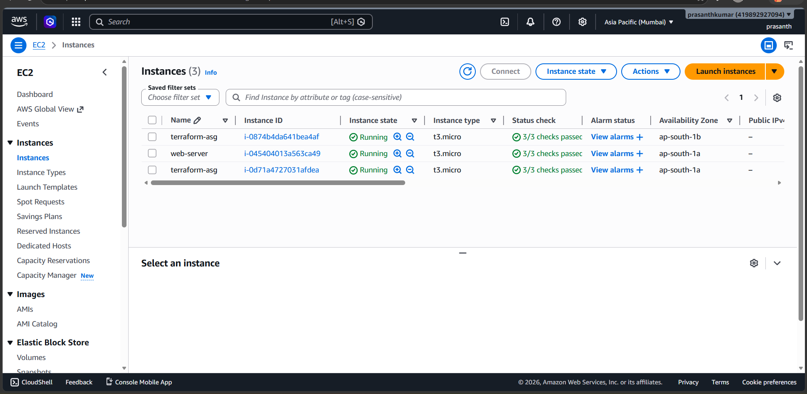

---

## Security Groups

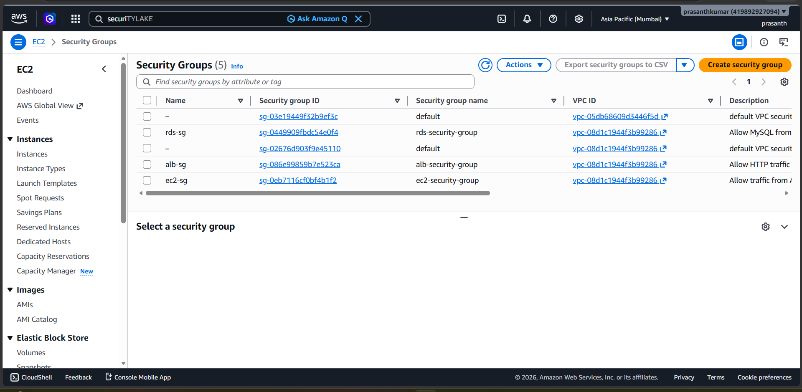

---

## Application Load Balancer

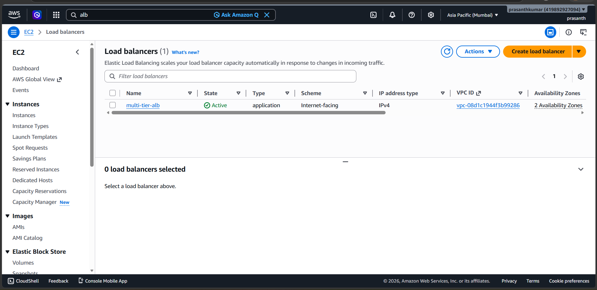

---

## Target Group

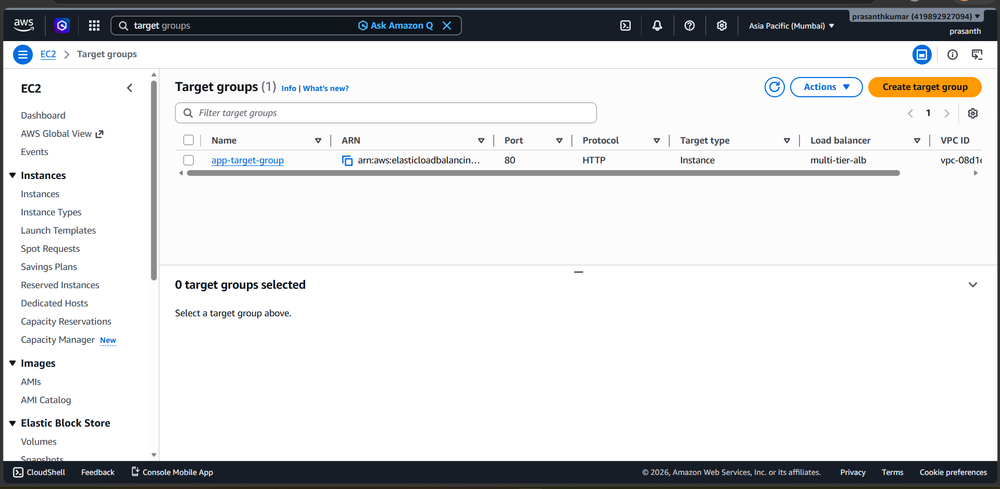

---

## Auto Scaling Group

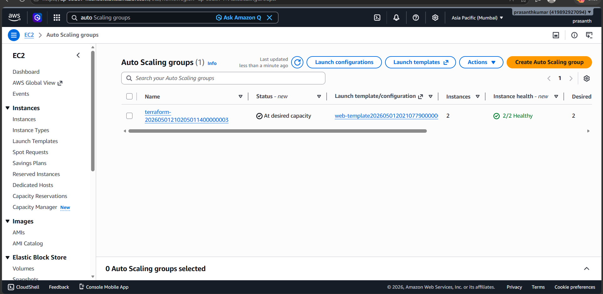

---

## Launch Template

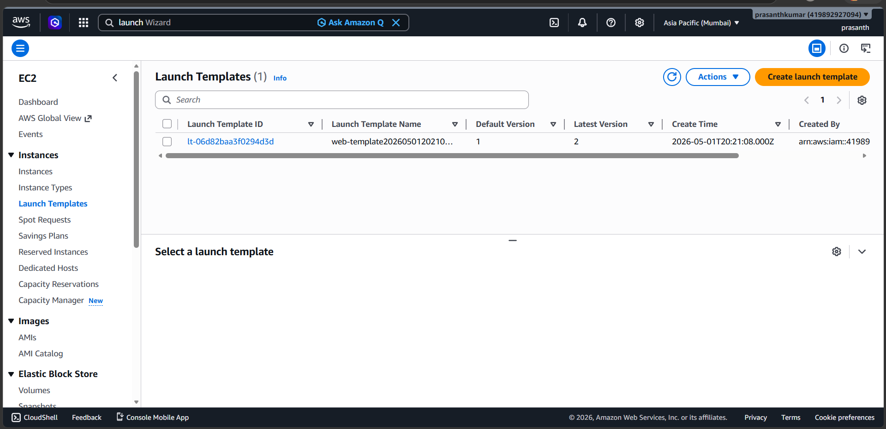

---

## RDS Database

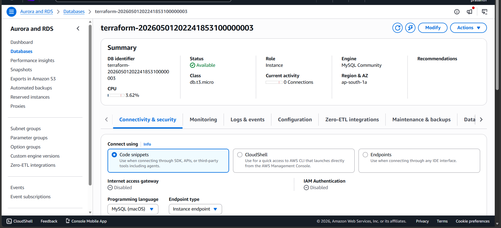

---

## Code

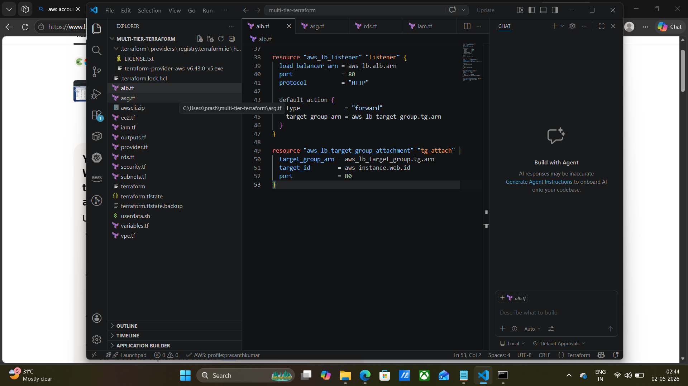

---

# 📌 Key Features

* Infrastructure as Code using Terraform
* Production-style multi-tier architecture
* Public & private subnet architecture
* Load balancing with ALB
* Auto Scaling implementation
* Secure RDS deployment in private subnet
* Reusable and modular Terraform structure
* Automated web server provisioning using user_data

---

# 🧠 Learning Outcomes

* AWS Networking
* Terraform Workflow
* Infrastructure Automation
* ALB & Target Groups
* Auto Scaling Concepts
* RDS Deployment
* Security Group Management
* Multi-Tier Architecture Design

---

# 👨‍💻 Author

Prasanth Kumar
